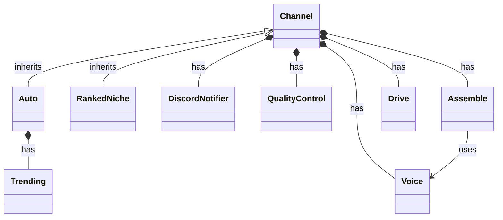

# auto-tube

Multi-channel short-form video production. Each channel subclasses
`Channel`, fills in content + editing style, and shares Discord, quality
gating, voice, captions, Drive, and (optionally) trending research.

Runs **3 times a day** via GitHub Actions (5am / 1pm / 8pm Denver time).
No auto-publish to YouTube — you review the Drive link first.

Requires **Python 3.11** (chatterbox-tts).

---

## Architecture (UML)



Triangle = inheritance. Filled diamond = composition (has-a).
To add a channel: subclass `Channel`, override `prepare`, `generate_script`, `render_segments`, `finalize_assembly`.

---

## Quick start

1. Put a 5–20s voice sample at `assets/auto/voice_reference.wav` (or `.mp3`)
2. Get every key below and add them as GitHub Actions secrets
3. Push, then run **Test run** or **Daily video draft** from the Actions tab

Optional: drop royalty-free music at `assets/auto/background_music.mp3`.

For RankedNiche, also put a voice sample at `assets/rankedniche/voice_reference.wav` (or `.mp3`) and optional SFX under `assets/rankedniche/sfx/`.

---

## Secrets — how to get each one

Add these under **Repo → Settings → Secrets and variables → Actions**.

### Shared (required)

#### `GEMINI_API_KEY`
1. Go to [Google AI Studio](https://aistudio.google.com/apikey)
2. Create an API key
3. Paste it as the secret

Used for topic picking and script writing.

#### `PEXELS_API_KEY`
1. Go to [Pexels API](https://www.pexels.com/api/)
2. Sign up / log in and create a key
3. Paste it as the secret

Used by Auto to download stock video clips for each script segment.

### Auto (required)

Workflows map these GitHub secrets into `AUTO_*` env vars expected by `main.py`:

| GitHub secret | Env var used at runtime |
|---------------|-------------------------|
| `DISCORD_WEBHOOK_URL` | `AUTO_DISCORD_WEBHOOK_URL` |
| `GOOGLE_CLIENT_ID` | `AUTO_GOOGLE_CLIENT_ID` |
| `GOOGLE_CLIENT_SECRET` | `AUTO_GOOGLE_CLIENT_SECRET` |
| `GOOGLE_REFRESH_TOKEN` | `AUTO_GOOGLE_REFRESH_TOKEN` |
| `DRIVE_FOLDER_ID` | `AUTO_DRIVE_FOLDER_ID` |

#### Discord webhook
1. In Discord: channel settings → **Integrations → Webhooks → New Webhook**
2. Copy the webhook URL
3. Paste it as `DISCORD_WEBHOOK_URL`

#### Google Drive (your account, not a service account)
1. In [Google Cloud Console](https://console.cloud.google.com/), create/select a project
2. Enable the **Google Drive API**
3. Create an OAuth client: **APIs & Services → Credentials → Create credentials → OAuth client ID → Desktop app**
4. Download the JSON and save it locally as `client_secret.json` in this repo folder
5. Run once on your laptop:
   ```bash
   pip install google-auth-oauthlib
   python get_drive_token.py
   ```
6. Copy the printed values into the Google secrets above
7. Create a Drive folder for reviews. The folder ID is the last part of the URL:
   `https://drive.google.com/drive/folders/THIS_PART` → secret `DRIVE_FOLDER_ID`
8. Delete local `client_secret.json` when you’re done

### RankedNiche (optional as a whole)

If any of these are missing, that channel is skipped and Auto still runs:

- `RANKEDNICHE_DISCORD_WEBHOOK_URL`
- `RANKEDNICHE_GOOGLE_CLIENT_ID`
- `RANKEDNICHE_GOOGLE_CLIENT_SECRET`
- `RANKEDNICHE_GOOGLE_REFRESH_TOKEN`
- `RANKEDNICHE_DRIVE_INTAKE_FOLDER_ID`
- `RANKEDNICHE_DRIVE_OUTPUT_FOLDER_ID`

### Optional (research / fallbacks)

Missing optional secrets just skip that source (Discord will say so). The run only fails if **every** research source fails and you didn’t set a topic override.

#### `HF_TOKEN`
Fallback when Gemini is down for script writing or topic picking.

#### `YOUTUBE_API_KEY`
1. In [Google Cloud Console](https://console.cloud.google.com/), same project as Drive is fine
2. Enable **YouTube Data API v3**
3. **Credentials → Create credentials → API key**
4. Paste it as the secret

Used for the “YouTube most popular” research source.

#### `REDDIT_CLIENT_ID` / `REDDIT_CLIENT_SECRET`
1. Log into Reddit → [prefs/apps](https://www.reddit.com/prefs/apps)
2. Click **create another app…**
3. Type: **script**, name/description anything, redirect uri `http://localhost:8080`
4. After create: the string under the app name is the **client id**; the **secret** is labeled secret
5. Paste both as secrets

Used for authenticated Reddit trending (anonymous `.json` is often blocked from GitHub Actions).

---

## Local run

```bash
# Python 3.11 + ffmpeg required
pip install -r requirements.txt

export GEMINI_API_KEY=...
export PEXELS_API_KEY=...
export AUTO_DISCORD_WEBHOOK_URL=...
export AUTO_GOOGLE_CLIENT_ID=...
export AUTO_GOOGLE_CLIENT_SECRET=...
export AUTO_GOOGLE_REFRESH_TOKEN=...
export AUTO_DRIVE_FOLDER_ID=...
# optional:
# export HF_TOKEN=...
# export YOUTUBE_API_KEY=...
# export REDDIT_CLIENT_ID=...
# export REDDIT_CLIENT_SECRET=...
# export VIDEO_TOPIC="optional fixed topic"
# export RANKEDNICHE_*=...

python main.py
```

Auto output lands under `build/auto/` before Drive upload.

Leave `VIDEO_TOPIC` unset to research trending automatically.

---

## Layout

| Path | Role |
|------|------|
| `main.py` | Builds Auto (+ RankedNiche if configured) and calls `.run()` |
| `engine/Channel.py` | Template method; owns Discord / QC / Voice / Assemble / Drive |
| `engine/Auto.py` | Autonomous research + Pexels + BGM channel |
| `engine/RankedNiche.py` | Drive intake countdown + SFX channel |
| `engine/Trending.py` | Multi-source topic research |
| `engine/QualityControl.py` | Script quality gate |
| `engine/DiscordNotify.py` | Discord webhook notifier |
| `engine/Assemble.py` | Captions, concat, BGM/SFX mix |
| `engine/Voice.py` | Chatterbox-Turbo voice clone |
| `engine/Drive.py` | Google Drive client |
| `get_drive_token.py` | One-time Drive OAuth helper |
